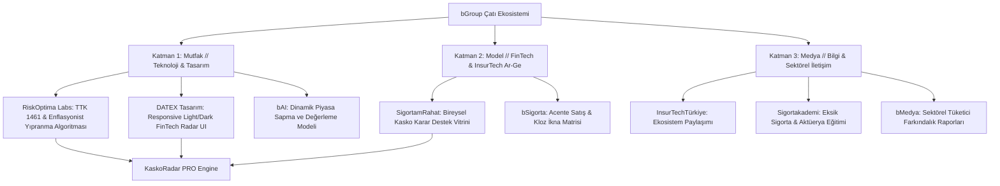

<div align="center">

# 🚗 KaskoRadar PRO `v1.0`
### **bGroup // InsurTech, Aktüeryal Modelleme & Karar Destek Ekosistemi**
*RiskOptima Labs × DATEX Tasarım × SigortamRahat Ortak Girişimi*

[](https://kaskoradar-pro.vercel.app/)
[](https://www.linkedin.com/in/batuhanbayatlı)
[](https://opensource.org/licenses/MIT)

<p align="center">
  <b>TTK Madde 1461 Standartlarında Eksik Sigorta (Under-Insurance), Rayiç Bedel Aşınması ve Enflasyon Koruma Simülatörü</b>
</p>

[🚀 Canlı Simülatörü Başlat](https://kaskoradar-pro.vercel.app/) • [🏢 bGroup Mimarisi](#-bgroup-ekosistem-mimarisi) • [📊 Aktüeryal & Hukuki Model](#-akt%C3%BCeryal--hukuki-model) • [👨‍💻 Geliştirici](#-geli%C5%9Ftirici--kurucu)

---

</div>

## 🌐 Genel Bakış

**KaskoRadar PRO**, araç piyasasında yaşanan dalgalanmalar ve yüksek enflasyon ortamında sigortalıların, acentelerin ve filo yöneticilerinin karşılaştığı en kritik finansal risklerden biri olan **Eksik Sigorta (Under-Insurance)** tehdidini görünür kılmak için geliştirilmiş yeni nesil bir InsurTech platformudur.

6102 sayılı Türk Ticaret Kanunu (TTK) Madde 1461 kuralını referans alarak; poliçe başlangıç bedeli ile kaza anındaki güncel rayiç piyasa değeri arasındaki farkı hesaplar, orantı kuralı (pro-rata) gereği hasar anında **sigortalının cebinden çıkacak gizli kesintiyi** ve rayiç koruma klozunun maliyet-fayda dengesini modeller.

---

## 🏢 bGroup Ekosistem Mimarisi

KaskoRadar PRO, **bGroup 3M** girişim modelinin sinerjisiyle geliştirilmiştir:



- **Mutfak Katmanı (RiskOptima Labs, DATEX Tasarım, bAI):** TTK 1461 oran-orantı kuralı algoritması, dinamik Chart.js görselleştirmesi ve çift tema (Light/Dark) destekli mobil reaktif arayüz.
- **Model Katmanı (SigortamRahat, bSigorta):** Araç sahiplerine dar/sabit bedelli kaskonun risklerini gösteren karar destek ekranı ve acenteler için katma değerli satış argümanı.
- **Medya Katmanı (InsurTechTürkiye, Sigortakademi, bMedya):** Eksik sigorta kaynaklı mağduriyetleri önlemeye yönelik sektörel bilinçlendirme içeriği.

---

## ⚡ Temel Yetenekler & Çözümler

| Modül | Çözülen Sektörel Problem | Mevzuat / Teknik Standart |
| :--- | :--- | :--- |
| **Eksik Sigorta Kesinti Radarı** | Hasar anında sigorta şirketinin yaptığı beklenmedik kesintiler | TTK Madde 1461 (Eksik Sigorta Kuralı) |
| **Rayiç Değer Aşınma Simülasyonu** | Yüksek enflasyonda poliçedeki sabit bedelin erimesi | Zaman Ayarlı Dinamik Enflasyon Eğrisi |
| **Kloz Koruma Analizörü** | "Rayiç değer klozu gerekli mi?" kararsızlığı | Tam Kasko vs Dar Kasko Maliyet/Fayda Analizi |
| **Çift Tema Desteği (Light/Dark)** | Farklı kullanıcı ortamlarına uygunsuz kontrast | Otomatik CSS Değişkenli Tema Motoru (Default: Light) |
| **%100 Client-Side Mimari** | Finansal ve araç verilerinin sunuculara iletilme riski | Sıfır veri tabanı, tarayıcı içi yerel işlem güvenliği |

---

## 📊 Aktüeryal & Hukuki Model

Simülatörün kullandığı temel formülasyon:

$$\text{Güncel Rayiç Değer} = \text{Poliçe Bedeli} \times \left(1 + \left(\frac{\text{Yıllık Enflasyon}}{12} \times \text{Geçen Ay}\right)\right)$$

$$\text{Teminat Karşılama Oranı} = \frac{\text{Poliçe Bedeli}}{\text{Güncel Rayiç Değer}}$$

$$\text{Şirketin Ödeyeceği Hasar} = \text{Toplam Hasar} \times \text{Teminat Karşılama Oranı}$$

$$\text{Cebinizden Çıkacak Kesinti} = \text{Toplam Hasar} - \text{Şirketin Ödeyeceği Hasar}$$

---

## 🛠️ Teknoloji Yığını

- **Frontend & UI:** HTML5, CSS3 (Modern Light/Dark Glassmorphism UI, Plus Jakarta Sans, Rajdhani, Fira Code)
- **Veri Görselleştirme:** Chart.js (Dinamik Doughnut Hasar Karşılama Grafiği)
- **İkonografi:** FontAwesome v6.4
- **Mimari:** %100 Client-Side (Sıfır veri sızıntısı, tam gizlilik)
- **Deployment:** Vercel Global Edge Network

---

## 💻 Yerel Geliştirme

```bash
# 1. Repoyu klonlayın
git clone [https://github.com/batuhanbayatli/kaskoradar-pro.git](https://github.com/batuhanbayatli/kaskoradar-pro.git)

# 2. Proje klasörüne geçin
cd kaskoradar-pro

# 3. Tarayıcınızda doğrudan çalıştırın
open index.html # macOS
start index.html # Windows
```

---

## 👨‍💻 Geliştirici & Kurucu

- **Batuhan Bayatlı** — *Founder & Lead InsurTech Developer @ bGroup*
- 💼 **LinkedIn:** [linkedin.com/in/batuhanbayatlı](https://www.linkedin.com/in/batuhanbayatlı)
- 🐙 **GitHub:** [github.com/batuhanbayatli](https://github.com/batuhanbayatli)

---

<div align="center">
  <sub>KaskoRadar PRO, <b>bGroup</b> bünyesindeki <b>RiskOptima Labs</b>, <b>DATEX Tasarım</b> ve <b>SigortamRahat</b> Ar-Ge mutfağında üretilmiştir.</sub><br/>
  <sub>© 2026 bGroup. MIT Lisansı ile açık kaynak olarak sunulmuştur.</sub>
</div>
